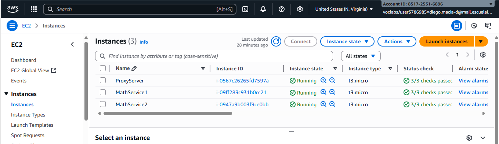
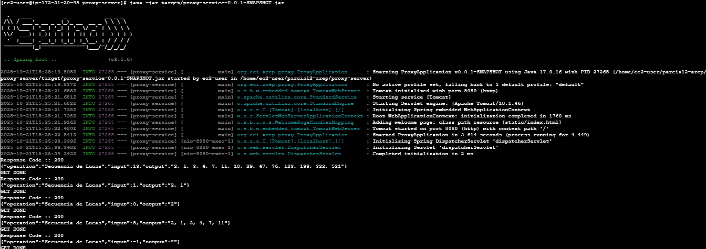
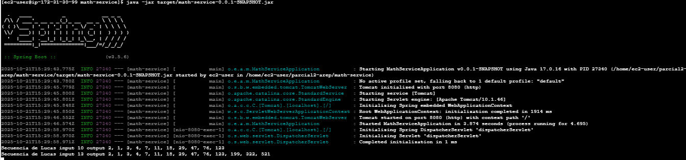
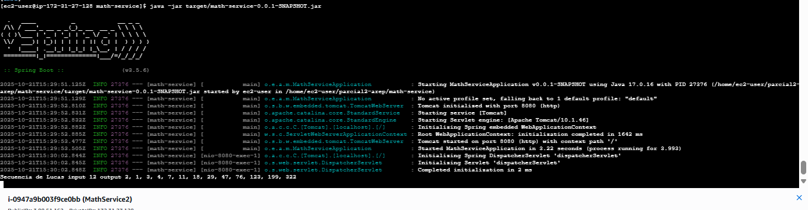
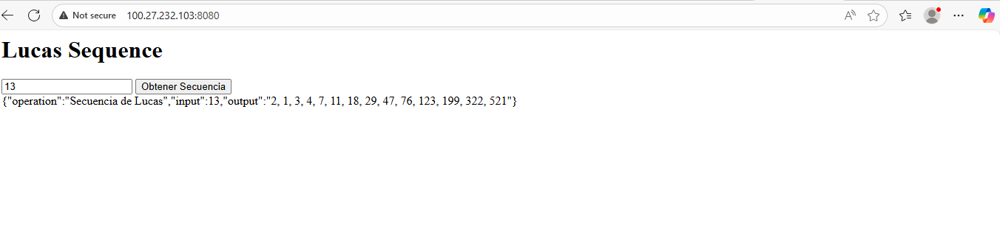

# Parcial Arep 2

## Prerrequisites
* Maven
* Git
* Java 17+

## Installation
clone the repository
```bash
git clone https://github.com/thesrcielos/parcial2-arep
```

There's two application in this project:
* Proxy Server containing frontend static files and making request to the math service server
* Math service server containing the math operation to make

Enter proxy server directory
```bash
cd proxy-server
```
Enter math service directory
```bash
cd math-service
```

Execute to build the project
```bash
mvn clean install
```

### Execution
Proxy Service.
Make sure to put the urls of the math services server in the file **Proxy Controller**

Example:
```java
private static final String[] servicesUrl = new String[]{"http://54.147.161.44:8080",  "http://3.88.51.162:8080"};
```
Execute the project
```bash
java -jar java -jar target/proxy-service-0.0.1-SNAPSHOT.jar
```
Math Service
```bash
java -jar target/math-service-0.0.1-SNAPSHOT.jar 
```

## AWS Deployment
Create 3 instances of EC2 Amazon Linux 2023 for each machine do the following

Install the following packages
```
sudo yum install git -y
sudo yum install maven -y
sudo dfn install java-17-amazon-corretto -y
```
Then follow the instructions given in the installation process. In two machines execute Math Service Server and in one the Proxy Server
## Enpoints
### Proxy Server
* /lucasseq?value={value} recieves a value to make a http reques to a math service instance to calculate lucas sequence
### MathService Server
* /lucasseq?value={value} receives a value and calculate lucas sequence

example output:

```json
{
    "operation":"Secuencia de Lucas",
    "input":13,
    "output":"2, 1, 3, 4, 7, 11, 18, 29, 47, 76, 123, 199, 322, 521"
}
```

## AWS Deployment Proofs
EC2 instances

Proxy Server Instance

Math Servcice Server 1 Instance

Math Servcice Server 2 Instance

Frontend


## Video AWS Deployment
https://pruebacorreoescuelaingeduco-my.sharepoint.com/:v:/g/personal/diego_macia-d_mail_escuelaing_edu_co/EbPxUUI1G_tMlvk8akd789cBjKUOVH-g4b60tBW4mhlZ3g?nav=eyJyZWZlcnJhbEluZm8iOnsicmVmZXJyYWxBcHAiOiJPbmVEcml2ZUZvckJ1c2luZXNzIiwicmVmZXJyYWxBcHBQbGF0Zm9ybSI6IldlYiIsInJlZmVycmFsTW9kZSI6InZpZXciLCJyZWZlcnJhbFZpZXciOiJNeUZpbGVzTGlua0NvcHkifX0&e=YPUEDH
